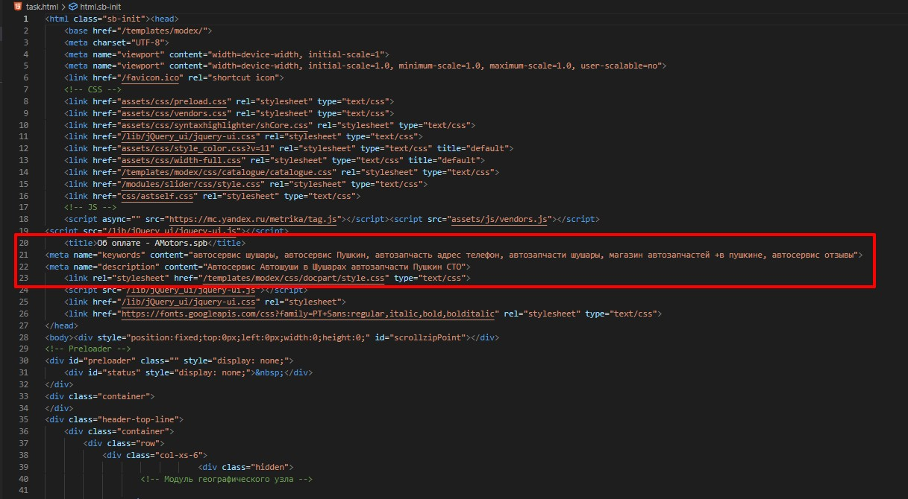

# Модуль 26. Практическая работа.

## Техническое задание.
* Дан html-код, с помощью итераций вырежьте из него мета теги (title description, keywords).

## Результат работы.
### До выполения

### После выполения

### Используемые технологии
* HTML
* PHP